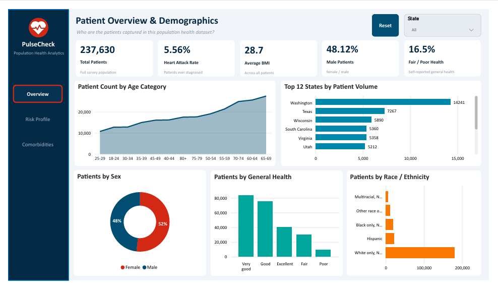
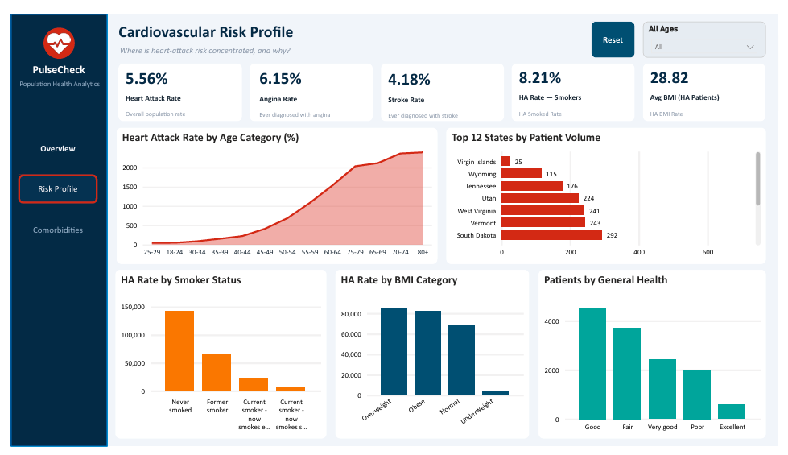
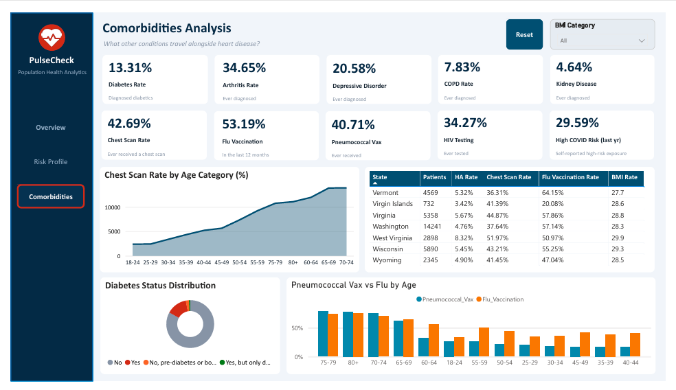

# 🫀 PulseCheck — Population Health Analytics Dashboard

[](https://powerbi.microsoft.com/)
[](https://learn.microsoft.com/dax/)
[](https://github.com/)

> **PulseCheck** is a Power BI population-health analytics dashboard designed to explore patient demographics, cardiovascular risk indicators, and comorbidities across the survey population.

---

## 📌 Project Description

PulseCheck provides an interactive analytical view of a population health dataset. The dashboard focuses on three major analytical areas:

1. **Patient Overview & Demographics**
2. **Cardiovascular Risk Profile**
3. **Comorbidities Analysis**

The dashboard combines headline KPIs with demographic, geographic, age, smoking, BMI, health-status, vaccination, and disease-related views.

The supplied dashboard report shows a total survey population of **237,630 patients**, with an overall **heart attack rate of 5.56%** and an **average BMI of 28.7**.

---

## 🎯 Business Problem / Objective

Population-health datasets can contain large numbers of demographic, health-status, disease, and preventive-care attributes. A dashboard is needed to turn these attributes into an accessible analytical view.

### Objectives

- Understand the composition of the patient population.
- Examine patient distribution across age groups, sex, race/ethnicity, and states.
- Monitor cardiovascular indicators such as heart attack, angina, and stroke rates.
- Analyze heart-attack-related measures across smoking status and BMI categories.
- Review the prevalence of selected comorbidities.
- Compare preventive-care indicators such as flu and pneumococcal vaccination.
- Provide interactive filtering through dashboard slicers.

---

# 📊 Dashboard Overview

PulseCheck contains three analytical pages.

| Page | Focus |
|---|---|
| **Overview** | Patient demographics and overall population KPIs |
| **Risk Profile** | Cardiovascular risk and heart-attack-related analysis |
| **Comorbidities** | Diseases, preventive care, and related health indicators |

---

# 1️⃣ Patient Overview & Demographics

### Purpose

The Overview page answers:

> **Who are the patients captured in this population health dataset?**

### Main visuals

- Patient Count by Age Category
- Top 12 States by Patient Volume
- Patients by Sex
- Patients by General Health
- Patients by Race / Ethnicity

### Headline KPIs

| KPI | Value | Definition shown in dashboard |
|---|---:|---|
| **Total Patients** | 237,630 | Full survey population |
| **Heart Attack Rate** | 5.56% | Patients ever diagnosed |
| **Average BMI** | 28.7 | Across all patients |
| **Male Patients** | 48.12% | Female / male |
| **Fair / Poor Health** | 16.5% | Self-reported general health |

The page also provides a **State** filter and a reset option.

---

# 2️⃣ Cardiovascular Risk Profile

### Purpose

The Risk Profile page answers:

> **Where is heart-attack risk concentrated, and why?**

### Headline KPIs

| KPI | Value | Definition shown in dashboard |
|---|---:|---|
| **Heart Attack Rate** | 5.56% | Overall population rate |
| **Angina Rate** | 6.15% | Ever diagnosed with angina |
| **Stroke Rate** | 4.18% | Ever diagnosed with stroke |
| **HA Rate — Smokers** | 8.21% | HA smoked rate |
| **Avg BMI (HA Patients)** | 28.82 | HA BMI rate |

### Main visuals

- Heart Attack Rate by Age Category
- State-level patient/risk view
- HA Rate by Smoker Status
- HA Rate by BMI Category
- Patients by General Health

The page includes an **All Ages** filter and reset option.

---

# 3️⃣ Comorbidities Analysis

### Purpose

The Comorbidities page answers:

> **What other conditions travel alongside heart disease?**

### Disease / condition KPIs

| KPI | Value | Definition shown in dashboard |
|---|---:|---|
| **Diabetes Rate** | 13.31% | Diagnosed diabetics |
| **Arthritis Rate** | 34.65% | Ever diagnosed |
| **Depressive Disorder** | 20.58% | Ever diagnosed |
| **COPD Rate** | 7.83% | Ever diagnosed |
| **Kidney Disease** | 4.64% | Ever diagnosed |

### Preventive-care / testing KPIs

| KPI | Value | Definition shown in dashboard |
|---|---:|---|
| **Chest Scan Rate** | 42.69% | Ever received a chest scan |
| **Flu Vaccination** | 53.19% | In the last 12 months |
| **Pneumococcal Vax** | 40.71% | Ever received |
| **HIV Testing** | 34.27% | Ever tested |
| **High COVID Risk** | 29.59% | Self-reported high-risk exposure |

### Main visuals

- Chest Scan Rate by Age Category
- Diabetes Status Distribution
- State-level health/risk table
- Pneumococcal Vaccination vs Flu Vaccination by Age

The page includes a **BMI Category** filter and reset option.

---

# 📈 KPIs & Definitions

The following KPI catalogue is based on the labels and definitions displayed in the supplied dashboard.

### Population KPIs

**Total Patients**  
Full survey population.

**Average BMI**  
Average BMI across the patient population.

**Male Patients**  
Percentage displayed for the male/female population split.

**Fair / Poor Health**  
Percentage associated with self-reported fair or poor general health.

### Cardiovascular KPIs

**Heart Attack Rate**  
Percentage of patients ever diagnosed with a heart attack.

**Angina Rate**  
Percentage of patients ever diagnosed with angina.

**Stroke Rate**  
Percentage of patients ever diagnosed with stroke.

**HA Rate — Smokers**  
Heart-attack-related rate displayed for smoking-status analysis.

**Avg BMI (HA Patients)**  
Average BMI displayed for heart-attack patients.

### Comorbidity KPIs

**Diabetes Rate**  
Percentage of diagnosed diabetics.

**Arthritis Rate**  
Percentage ever diagnosed with arthritis.

**Depressive Disorder**  
Percentage ever diagnosed with depressive disorder.

**COPD Rate**  
Percentage ever diagnosed with COPD.

**Kidney Disease**  
Percentage ever diagnosed with kidney disease.

### Preventive Care / Testing KPIs

**Chest Scan Rate**  
Percentage who have ever received a chest scan.

**Flu Vaccination**  
Percentage vaccinated within the last 12 months.

**Pneumococcal Vax**  
Percentage who have ever received pneumococcal vaccination.

**HIV Testing**  
Percentage who have ever been tested for HIV.

**High COVID Risk**  
Percentage associated with self-reported high-risk exposure in the last year.

---

# 🔎 Key Insights

The dashboard surfaces several descriptive patterns in the supplied population:

- The dashboard represents **237,630 patients**.
- The overall heart-attack rate displayed is **5.56%**.
- The reported average BMI across the population is **28.7**.
- The displayed sex distribution is approximately **52% female and 48% male**; the KPI specifically shows **48.12% male patients**.
- The Overview page shows substantial variation in patient volume across age groups and states.
- The Risk Profile page compares heart-attack-related measures by **age, smoking status, BMI category, and general health**.
- The Comorbidities page highlights **arthritis, depressive disorder, diabetes, COPD, and kidney disease** alongside preventive-care indicators.
- The state table on the Comorbidities page demonstrates that heart-attack rate, chest-scan rate, flu vaccination rate, and BMI vary across states. For example, the displayed rows include Vermont, Virgin Islands, Virginia, Washington, West Virginia, Wisconsin, and Wyoming.
- The dashboard supports filtering by **State**, **Age**, and **BMI Category** depending on the page.

> **Important:** These are descriptive dashboard observations. The dashboard itself does not establish that one factor causes another.

---

# 🛠️ Tools & Technologies

| Technology | Purpose |
|---|---|
| **Microsoft Power BI Desktop** | Dashboard development and visualization |
| **DAX** | KPI and analytical calculations |
| **Power BI Visuals** | Charts, KPI cards, tables, slicers, and analytical views |
| **GitHub** | Version control and portfolio presentation |

The supplied PDF identifies the report as a **Power BI Desktop** dashboard.

---

# 🧮 DAX Documentation

The dashboard PDF exposes KPI names and displayed results, but it does **not expose the underlying DAX expressions**. Therefore, exact DAX formulas should be documented from the `.pbix` model rather than inferred from the PDF.

A recommended DAX documentation format is:

| Measure | Purpose | DAX Expression |
|---|---|---|
| Total Patients | Count of patients | Add exact measure from PBIX |
| Heart Attack Rate | Percentage ever diagnosed | Add exact measure from PBIX |
| Average BMI | Average patient BMI | Add exact measure from PBIX |
| Male Patients % | Male share of population | Add exact measure from PBIX |
| Diabetes Rate | Diagnosed diabetes percentage | Add exact measure from PBIX |
| Arthritis Rate | Arthritis prevalence | Add exact measure from PBIX |
| COPD Rate | COPD prevalence | Add exact measure from PBIX |
| Kidney Disease Rate | Kidney disease prevalence | Add exact measure from PBIX |

### Example documentation pattern

```DAX
Measure Name =
    -- Add the actual DAX expression from the PBIX model
```

**Note:** Do not publish placeholder formulas as if they were the actual calculations. Replace these entries with the measures from your Power BI model.

---

# 🗂️ Data / Model Description

The dashboard is based on a population-health survey dataset.

The PDF shows analytical fields/categories relating to:

### Demographics
- Age Category
- Sex
- Race / Ethnicity
- State

### Health
- General Health
- BMI
- Smoking Status

### Cardiovascular Conditions
- Heart Attack
- Angina
- Stroke

### Comorbidities
- Diabetes
- Arthritis
- Depressive Disorder
- COPD
- Kidney Disease

### Preventive Care / Testing
- Chest Scan
- Flu Vaccination
- Pneumococcal Vaccination
- HIV Testing
- COVID-risk indicator

The PDF does not expose the complete Power BI data model, relationships, source-table names, or column-level metadata. Those should be added from the `.pbix` model if you want a technical data-model section.

---

# 📁 GitHub Repository Structure

Recommended repository structure:

```text
PulseCheck-PowerBI-Dashboard/
│
├── README.md
│
├── PowerBI/
│   └── PulseCheck.pbix
│
├── Screenshots/
    ├── overview.png
    ├── risk-profile.png
    └── comorbidities.png
```

### Data privacy

If the underlying dataset contains personal, confidential, licensed, or restricted information, **do not upload it to a public GitHub repository**. Instead, provide a description of the dataset or use a permitted/public sample dataset.

---

# 🖼️ Screenshots

## Patient Overview & Demographics



## Cardiovascular Risk Profile



## Comorbidities Analysis




---

# 💼 Portfolio Project Description

### Short Version

**PulseCheck — Population Health Analytics Dashboard**

Developed an interactive Power BI dashboard to analyze population-health data across demographics, cardiovascular risk factors, comorbidities, and preventive-care indicators. The dashboard provides KPI-driven views of patient volume, heart-attack rates, BMI, smoking status, age groups, state-level measures, chronic conditions, vaccination, and health-testing indicators.

### Resume / LinkedIn Version

**PulseCheck | Power BI Population Health Analytics**

- Developed a multi-page Power BI dashboard for population-health analytics.
- Created demographic, cardiovascular-risk, and comorbidity analysis views.
- Built KPI-driven reporting for patient volume, heart attack, BMI, diabetes, arthritis, COPD, kidney disease, vaccination, and testing indicators.
- Implemented interactive analytical views by age, state, smoking status, BMI category, sex, race/ethnicity, and general health.
- Designed the dashboard to support descriptive analysis of population-health patterns.

---

# 🚀 How to Use

1. Clone or download this repository.
2. Open the `.pbix` file using Microsoft Power BI Desktop.
3. Review the data-source configuration.
4. Refresh the model if the underlying data source is available and permitted.
5. Navigate through:
   - Overview
   - Risk Profile
   - Comorbidities

---

# 📌 Dashboard Scope

This project is intended for **analytics and visualization** of the supplied population-health dataset.

The dashboard provides descriptive statistics and comparisons. It should not be interpreted as a clinical diagnostic tool or as evidence of causal relationships.

---

# 👤 Author

**Shabaan Tariq**

Data Engineering | Business Intelligence | Power BI

---

## ⭐ Project Highlights

**3 Dashboard Pages**  
Overview • Risk Profile • Comorbidities

**237,630 Patients**  
Full survey population shown in the dashboard

**Multiple Analytical Dimensions**  
Age • State • Sex • Race/Ethnicity • BMI • Smoking • General Health

**Health & Risk Indicators**  
Heart Attack • Angina • Stroke • Diabetes • Arthritis • COPD • Kidney Disease

**Preventive Care Indicators**  
Flu Vaccination • Pneumococcal Vaccination • Chest Scan • HIV Testing
